# BONEKIFY - Tugas Besar IF3110

Bonekify is a music streaming web application service similar to Spotify.

Users are able to search and listen to a variety of songs. Surfing and exploring new songs is a breeze as Bonekify has displays for song/album information and list. Bonekify features a song management system for admins to add, change, and delete songs/albums. Admins are also able to see the list of users using the service. Users can also listen to premium songs feature. To do so, users can subscribe to the premium singers first which then will be validated by admin from the Bonekify Premium App.

Bonekify consists of five repositories :
- tugas-besar-1 : The app for Bonekify plain app where users can surf the music. It is built on vanilla html css js and php.
- bonekify-premium-app : The app for singers to edit their songs and admin to validate subscriber requests. It is built on React and material UI.
- bonekify-rest-service : Back-end side from Bonekify for the account and songs. It is built on Node express js (rest api).
- bonekify-soap-service : Back-end side from Bonekify for the subscription requests. It is built on jasx (soap).

## Table of Contents
- [BONEKIFY - Tugas Besar 1 IF3110](#bonekify---tugas-besar-1-if3110)
  - [Table of Contents](#table-of-contents)
  - [Running the Server](#running-the-server)
  - [Screenshots](#screenshots)
  - [Tasks Allocation](#tasks-allocation)
  - [Perubahan Implementasi](#perubahan-implementasi)

## Running the Server
Please refer to requirements and installations in the Bonekify Config Repository first.
Then, you can run Docker with the command:
```
docker compose up
```

The web application will now be up and running. It is now locally accessible through port 1300 for the plain Bonekify and 1301 for the premium Bonekify.

<b><a href="http://localhost:1300/public">http://localhost:1300/public</a></b>
<b><a href="http://localhost:1300/public">http://localhost:1301</a></b>

## Screenshots
- Bonekify Plain App: 
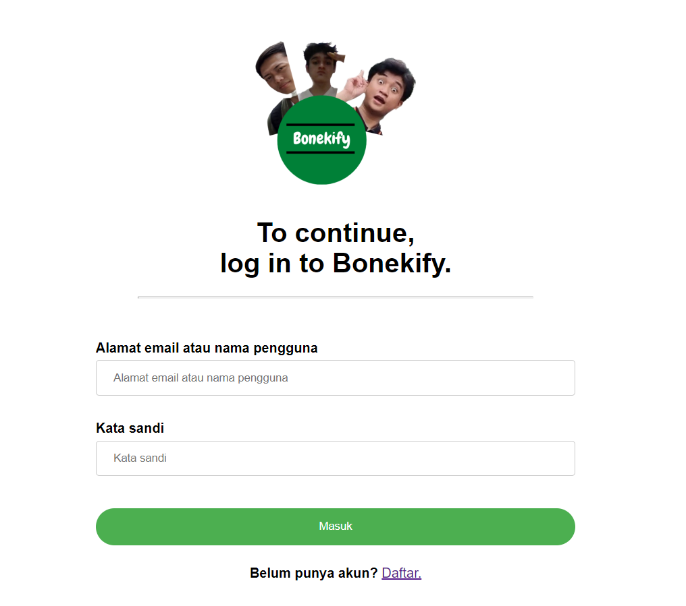
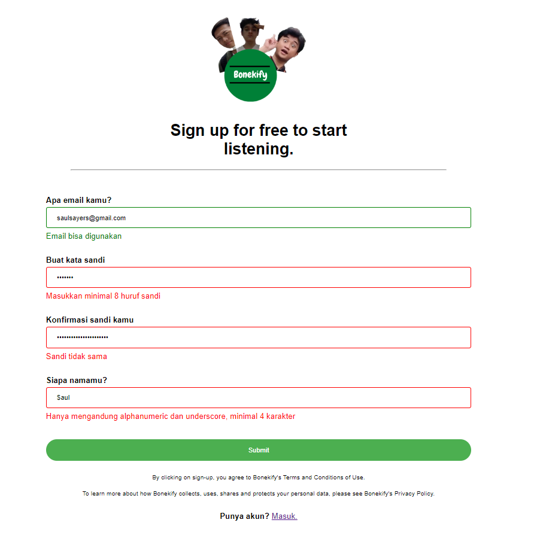
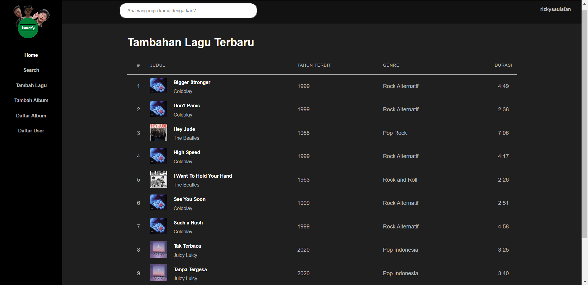
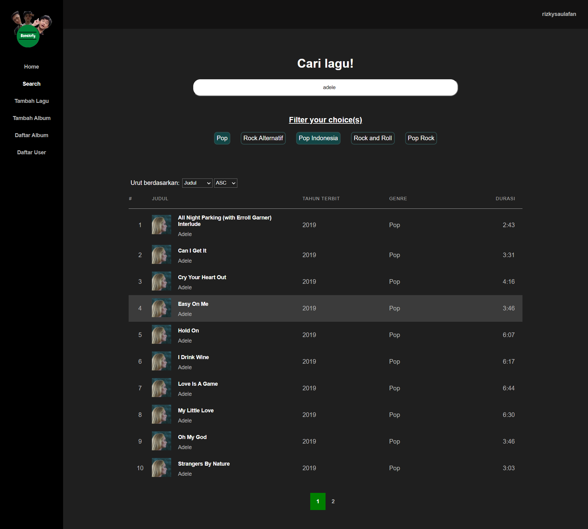
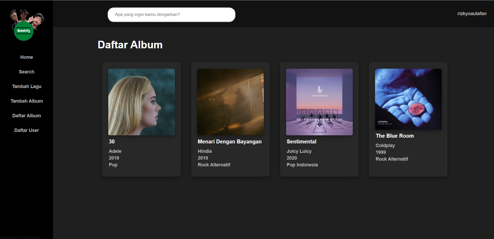

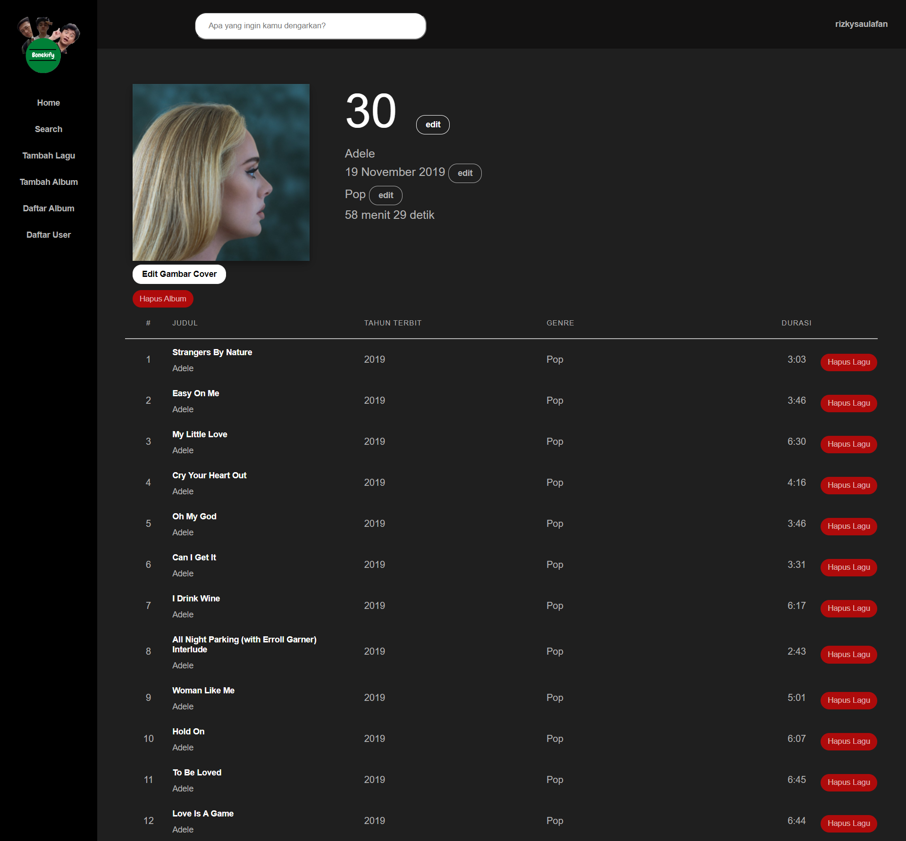
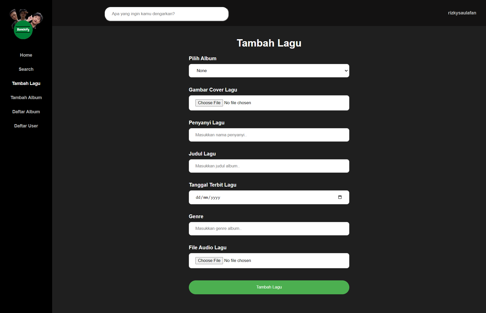
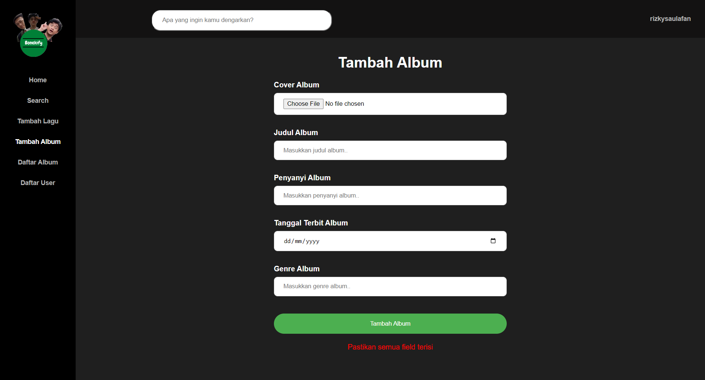

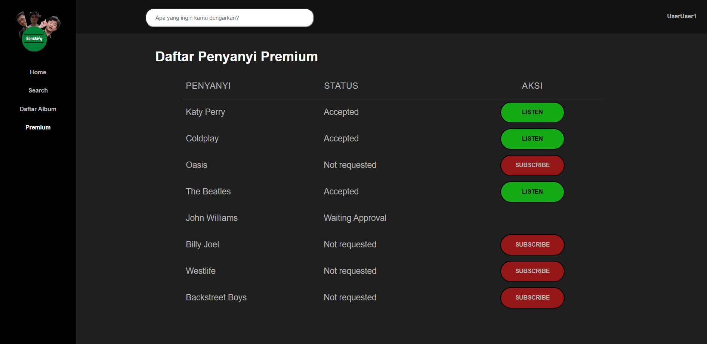
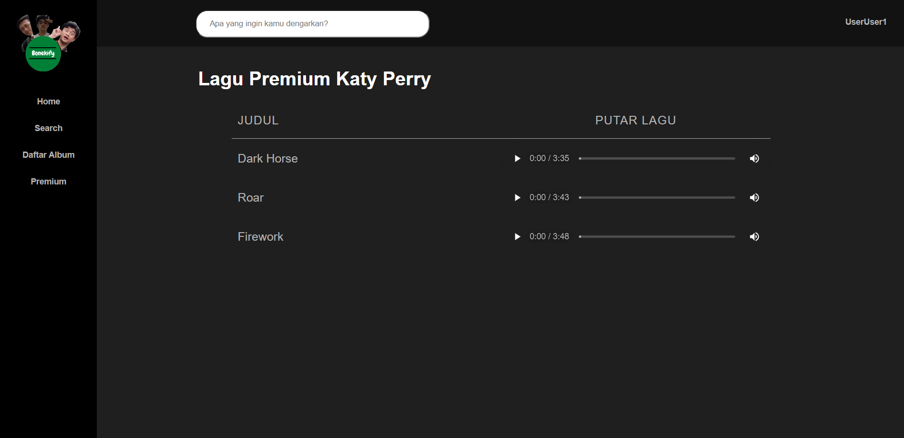

- Bonekify Premium App: 
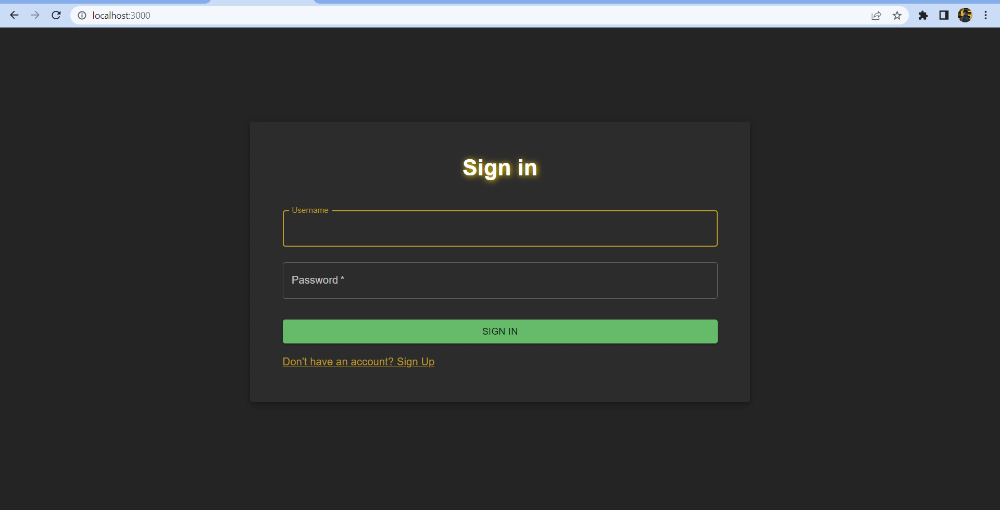
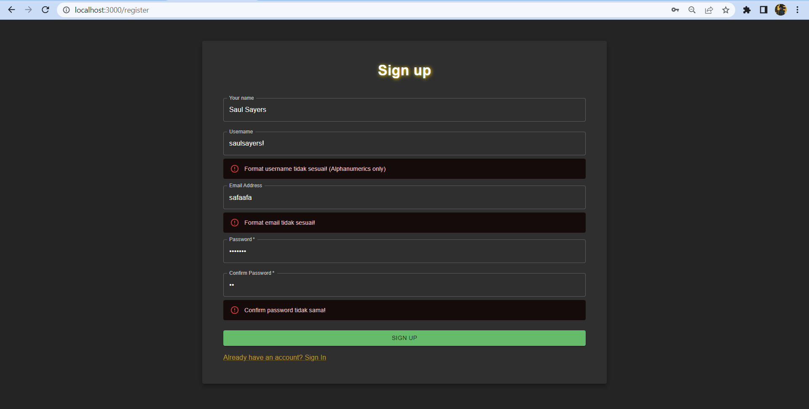
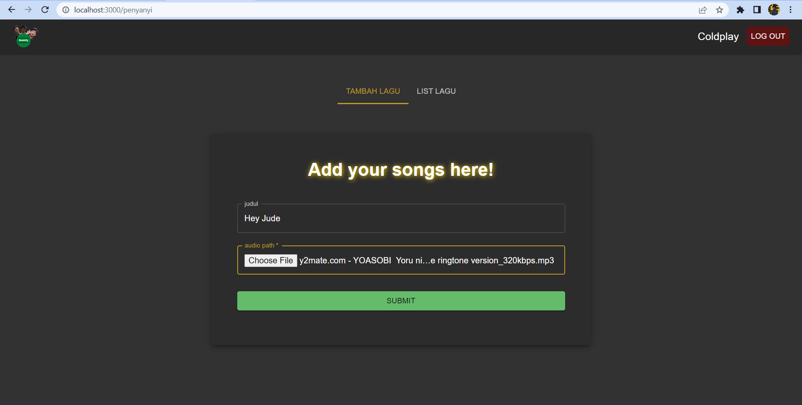
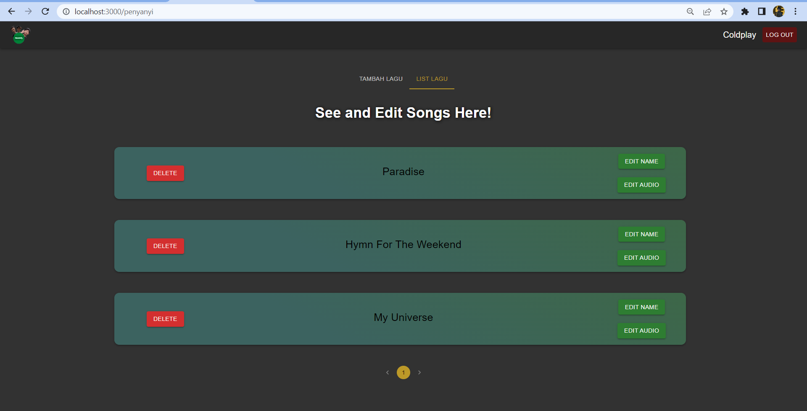
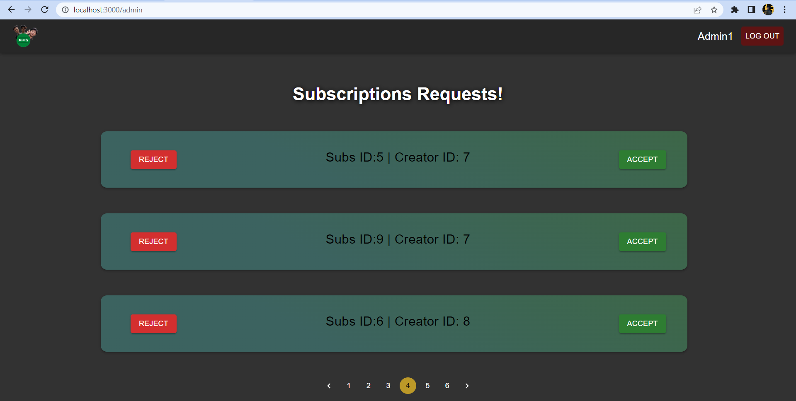

## Tasks Allocation
This project is made by:
- <a href="https://www.linkedin.com/in/ahmad-alfani-handoyo/"> Ahmad Alfani Handoyo (13520023)</a>
- <a href="https://www.linkedin.com/in/saulsayers/?originalSubdomain=id">Saul Sayers (13520094)</a>
- <a href="https://www.linkedin.com/in/rizky-ramadhana-putra-kusnaryanto-6037a51aa/">Rizky Ramadhana Putra Kusnaryanto (13520151)</a>
