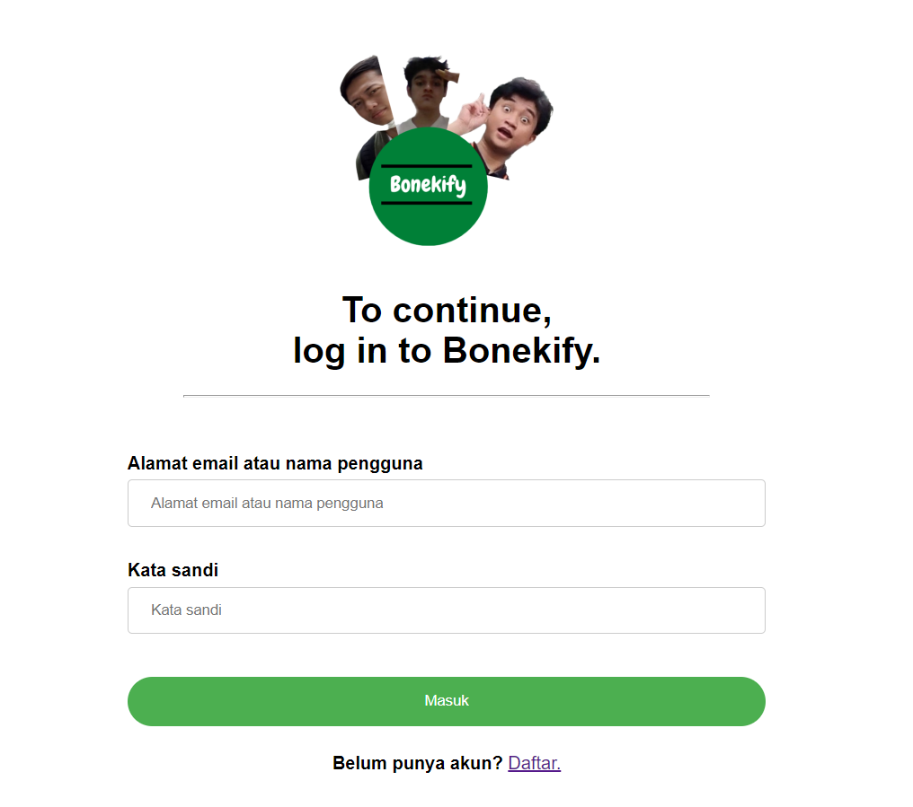
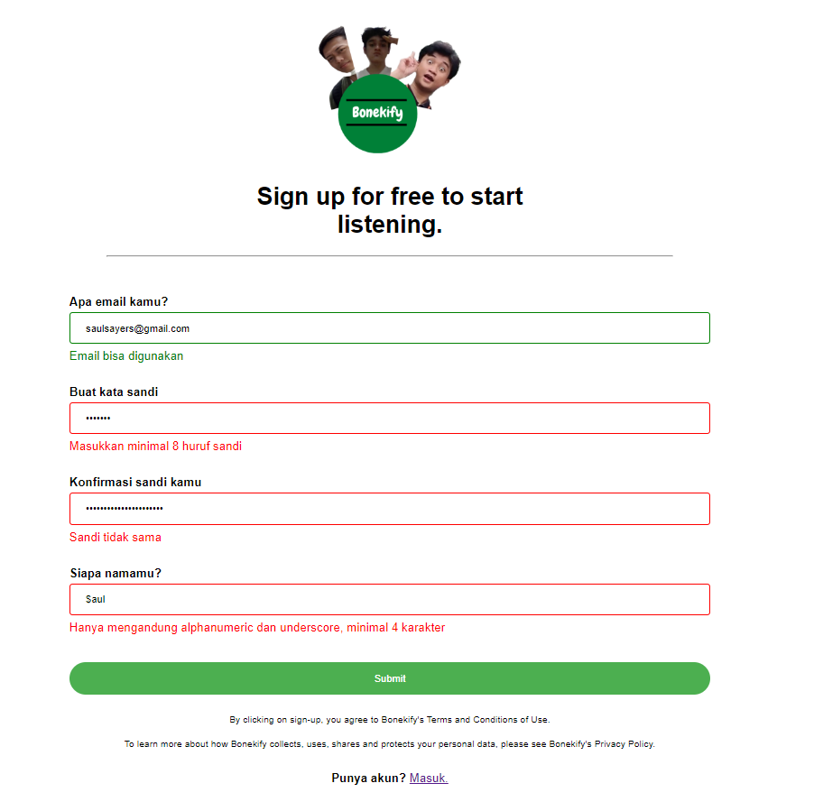
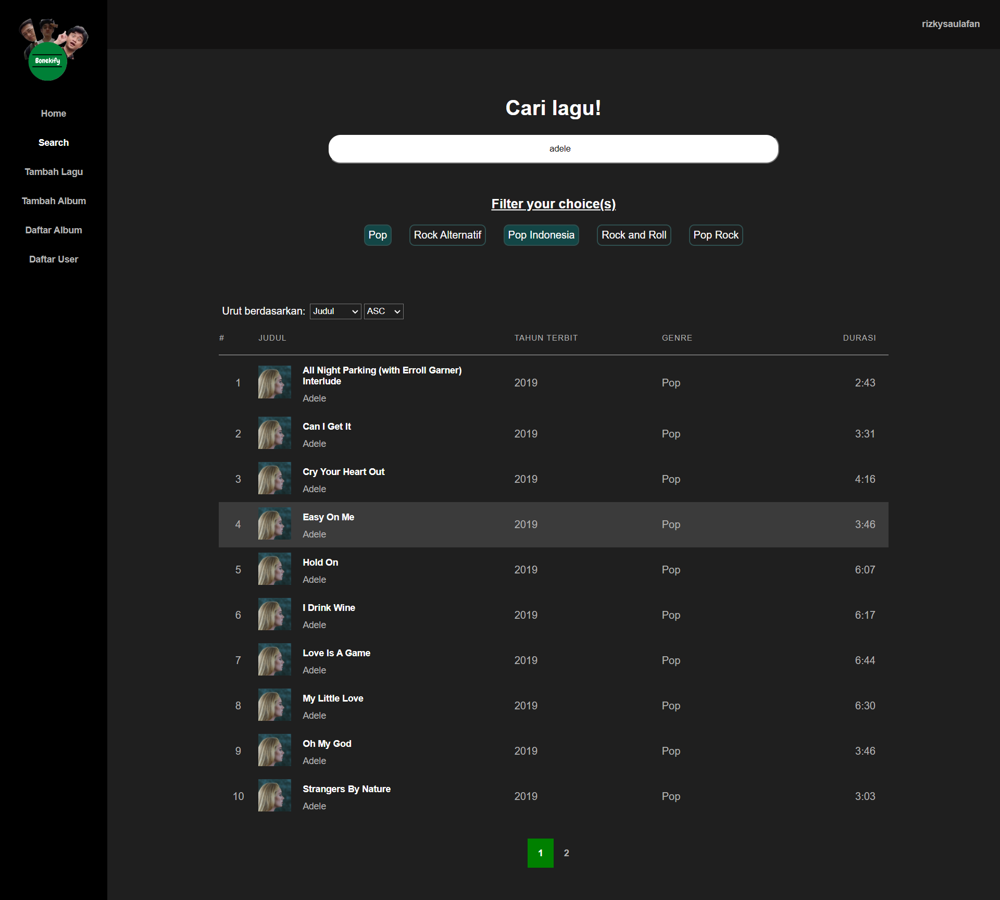
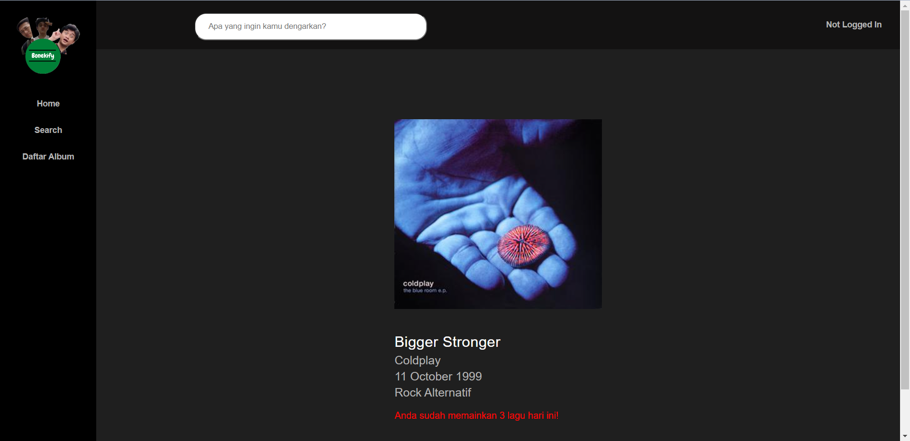
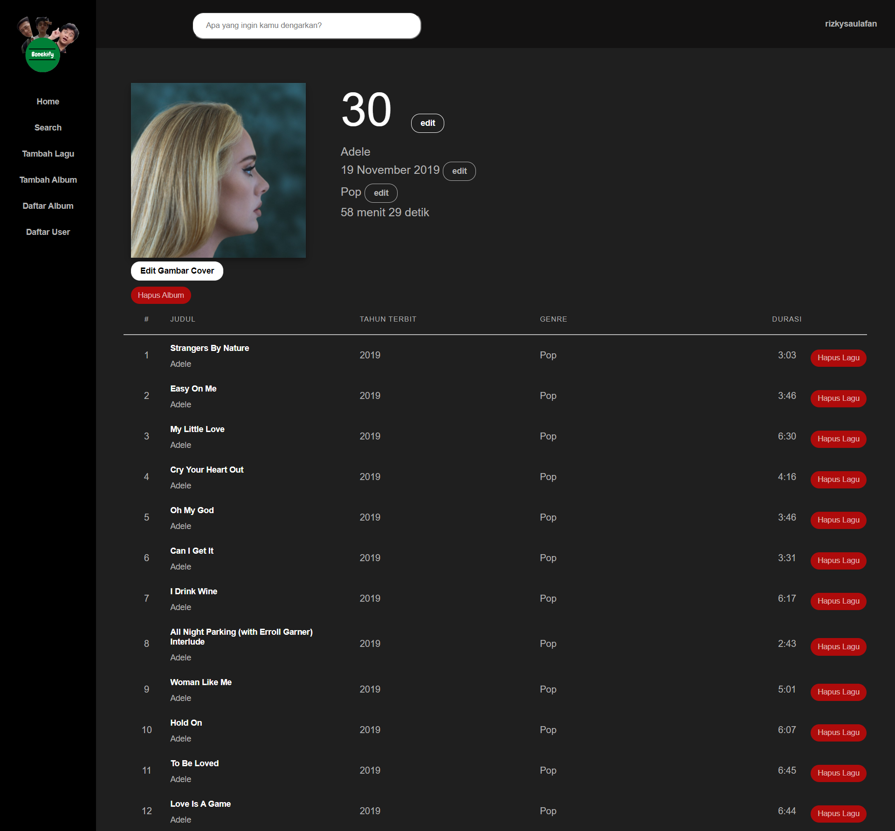
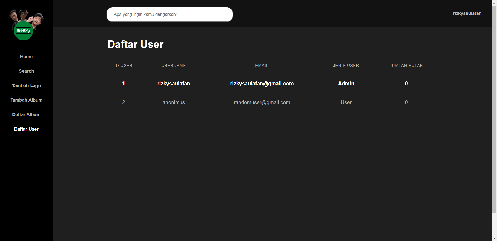

# BONEKIFY - Tugas Besar 1 IF3110

Bonekify is a music streaming web application service similar to Spotify.

Users are able to search and listen to a variety of songs. Surfing and exploring new songs is a breeze as Bonekify has displays for song/album information and list. Bonekify features a song management system for admins to add, change, and delete songs/albums. Admins are also able to see the list of users using the service.

Bonekify is built on vanilla HTML, CSS, and JavaScript with native PHP. Data is stored on a MySQL server.

## Table of Contents
  - [Table of Contents](#table-of-contents)
  - [Requirements](#requirements)
  - [Installation](#installation)
  - [Running the Server](#running-the-server)
  - [Screenshots](#screenshots)
  - [Tasks Allocation](#tasks-allocation)
## Requirements
As the server is running on a Docker container, make sure to first install Docker.

You can choose to install Docker with <a href="https://www.docker.com/products/docker-desktop/">Docker Desktop</a> or a CLI.

## Installation
Once Docker is installed, run Docker.

To run the server, first build the container. Go to the root directory of the repository and run:
```
docker compose up --build
```
The command will build and run the container for the first time.

A container will be made with 3 containers inside of it:
- MySQL server
- Web server
- phpMyAdmin

## Running the Server
Make sure Docker is running and run:
```
docker compose up
```

The web application will now be up and running. It is now locally accessible through port 8080.

<b><a href="http://localhost:8080/public">http://localhost:8080/public</a></b>

## Screenshots












## Tasks Allocation
This project is made by:
- <a href="https://www.linkedin.com/in/ahmad-alfani-handoyo/"> Ahmad Alfani Handoyo (13520023)</a>
- <a href="https://www.linkedin.com/in/saulsayers/?originalSubdomain=id">Saul Sayers (13520094)</a>
- <a href="https://www.linkedin.com/in/rizky-ramadhana-putra-kusnaryanto-6037a51aa/">Rizky Ramadhana Putra Kusnaryanto (13520151)</a>

Halaman | Client-side | Server-side 
--- | --- | ---
Login | 13520094 | 13520094
Register | 13520094 |  13520094
Home | 13520023, 13520094, 13520151| 13520094
Search, Sort, and Filter | 13520094 |  13520094
Daftar Album | 13520023, 13520094, 13520151 |  13520151
Detail Lagu | 13520023, 13520151 |  13520023, 13520151
Detail Album | 13520023, 13520151 |  13520023, 13520151
Tambah Lagu | 13520023 | 13520023, 13520151
Tambah Album | 13520023 |  13520023, 13520151
Daftar User | 13520023 | 13520023  
